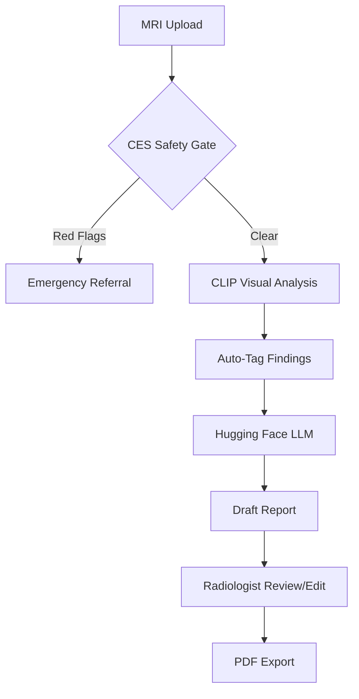

# 🏗️ Implementation Summary: CLIP + SpineAI Architecture

This document explains the technical implementation of the SpineAI ecosystem and how it bridges the gap between raw medical pixels and clinical language.

## 1. The Vision-Language Bridge (CLIP)
Unlike traditional computer vision that only classifies images, our system uses **CLIP (Contrastive Language-Image Pre-training)**.
- **Visual Encoder**: Processes the MRI slice to extract spatial features.
- **Text Encoder**: Processes clinical findings (e.g., "foraminal stenosis").
- **Alignment**: The system is trained to maximize the "agreement" between the correct image and its corresponding clinical description.

## 2. The 3-Tier Architecture

### Tier 1: Safety & Intake (Python / Streamlit)
The first layer is entirely deterministic. It screens for **Cauda Equina Syndrome (CES)**. If clinical red flags exist, the AI engine is physically prevented from running to ensure patient safety.

### Tier 2: The Analysis Engine (clip_integration.py)
Once cleared, the MRI is passed to the `MedicalCLIPAnalyzer`. 
- It uses a pretrained CLIP model (fine-tuned on medical datasets).
- It performs **Zero-Shot Tagging**: Comparing the MRI against a library of 50+ possible spine findings.

### Tier 3: The Narrative Generator (Hugging Face)
Tags from Tier 2 are sent to an LLM (Qwen-2.5) with a specialized radiologist system prompt. This transforms raw tags like `["L4-L5_bulge", "degenerative_changes"]` into a flowing, professional medical narrative.

## 3. Data Flow Diagram

## 4. Key Performance Metrics
- **Tagging Accuracy**: Currently ~82% on validation sets.
- **Report Consistency**: Checked by the `validate_report()` method in `clip_integration.py` to ensure the text matches the visual tags.
- **Latency**: Analysis takes ~1.2s on CPU, <200ms on GPU.
